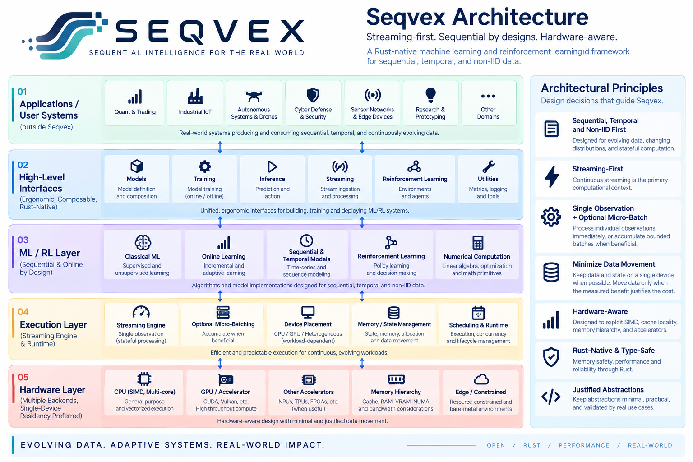
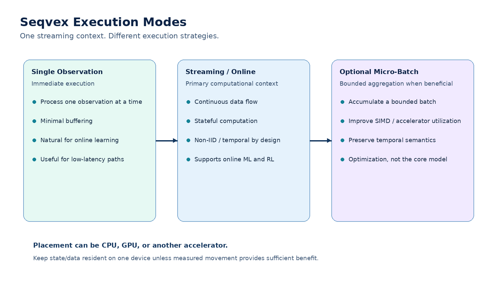
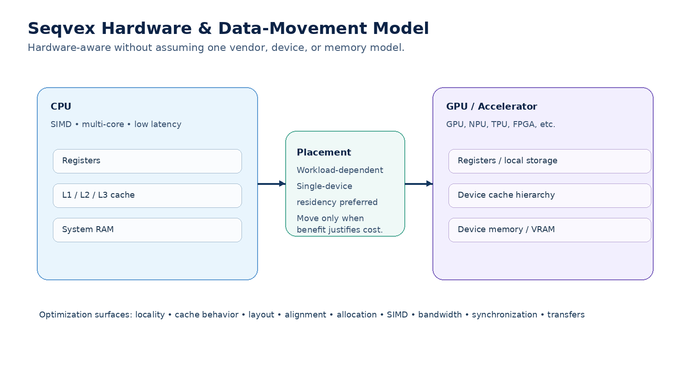
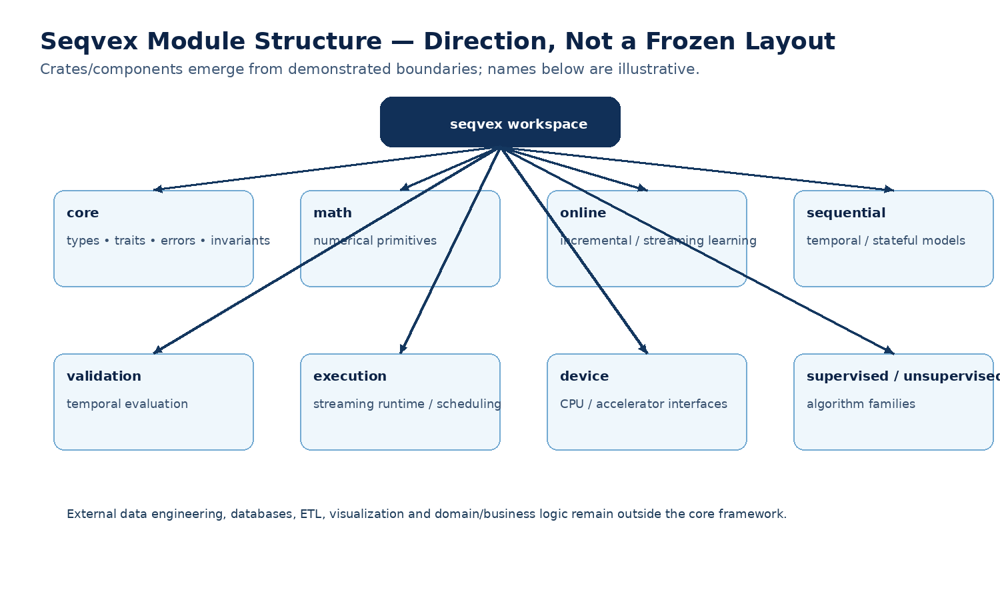

# Seqvex Architecture

> **Status:** Early-stage architecture / living technical document  
> **Project:** Seqvex  
> **Language:** Rust  
> **License:** Apache-2.0  
> **Current release:** `0.1.0`

<p align="center">
  
</p>

## 1. Architectural motivation

Seqvex is being built from a specific problem rather than from a generic desire to create another ML library.

Many existing ML workflows are naturally expressed around:

```text
static dataset
     ↓
batch / mini-batch
     ↓
offline training
     ↓
model
     ↓
separate inference
```

That model is appropriate for many workloads.

Seqvex addresses a different class of systems:

```text
evolving observations
        ↓
sequential / temporal / non-IID
        ↓
continuous stream
        ↓
persistent model state
        ↓
learning and/or inference
        ↓
new observations
        ↺
```

The architectural question is:

> **What should an ML/RL framework look like when sequential, temporal, non-IID, stateful, continuously arriving data is a primary design assumption rather than an edge case?**

A second question follows:

> **How can that execution model retain enough control over memory, computation, and hardware placement to support efficient and predictable execution from conventional CPUs through accelerators and constrained deployments?**

Seqvex answers these questions incrementally through implementation, testing, benchmarking, and profiling.

## 2. Core architectural stance

Four principles currently define the architecture:

1. **Sequential, temporal and non-IID data is foundational.**
2. **Streaming is the primary computational context.**
3. **Single-observation execution is fundamental; micro-batching and larger batching are available when computationally beneficial.**
4. **Execution semantics are separated from compute placement.**

Batching is therefore not forbidden.

The distinction is:

> **Batch capability is retained; batch-first semantics are not the architectural foundation.**

## 3. Data semantics

Seqvex treats the following as important properties of the computational problem:

- temporal ordering;
- sequential dependence;
- non-IID observations;
- evolving distributions;
- persistent state;
- continuous observations;
- feedback between system outputs and future observations.

The framework should not silently discard those properties simply to fit a static dataset abstraction.

## 4. Scope by process responsibility

Seqvex differentiates its scope by **process responsibility rather than by individual function**. It owns the computational stages from ML/RL preprocessing and representation through model execution, training, validation, inference, and learning. General-purpose data ingestion, manipulation, cleaning, exploratory analysis, visualization, and storage remain outside the framework.

This boundary is based on the **role of a computation in the ML/RL pipeline**, not on the name or category of the operation. For example, one-hot encoding, normalization/standardization, PCA, rolling statistics, online statistics, and other transformations may be implemented by Seqvex when they form part of an ML/RL computational method or pipeline. The same operation may remain outside Seqvex when used as general-purpose data analysis or manipulation.

Conceptually:

```text
External data ecosystem
        │
        ├─ ingestion
        ├─ storage / databases
        ├─ general data manipulation
        ├─ general-purpose cleaning
        └─ exploratory analysis / visualization
        │
        ▼
Seqvex ML/RL pipeline
        │
        ├─ preprocessing / representation
        ├─ model computation
        ├─ training / learning
        ├─ validation
        └─ inference / execution
```

Seqvex therefore does not attempt to replace dataframe, ETL, database, visualization, or general scientific/data-analysis ecosystems. It begins where computation becomes part of the ML/RL pipeline and continues through execution.

## 5. Streaming-first execution

<p align="center">
  
</p>

Streaming is the primary execution context.

Conceptually:

```text
observation_t
      ↓
model / state
      ↓
prediction / action
      ↓
state update
      ↓
observation_(t+1)
      ↓
...
```

A stream can originate from live sensors, network events, application events, historical data replay, databases, files, or other external systems.

Therefore:

> **Streaming describes the execution semantics, not necessarily the physical origin of the data.**

A historical dataset can be replayed as a stream.

A live system can produce an effectively unbounded stream.

## 6. Execution strategies

<p align="center">
  
</p>

### 5.1 Single observation

One observation is processed immediately.

Relevant to:

- low-latency inference;
- online learning;
- adaptive estimators;
- reinforcement learning;
- event-driven systems;
- constrained edge systems.

The framework should not require an artificial batch merely to make an observation executable.

### 5.2 Streaming / online

The model maintains state while observations arrive:

```text
x₁ → state₁
x₂ → state₂
x₃ → state₃
...
```

The state may represent model parameters, hidden state, running statistics, optimizer state, policy/value state, or other algorithm-specific information.

### 5.3 Optional micro-batching

Micro-batching accumulates a bounded number of observations:

```text
x₁
x₂
x₃
x₄
 ↓
[x₁ x₂ x₃ x₄]
 ↓
vectorized / parallel computation
```

It may improve:

- SIMD utilization;
- cache efficiency;
- CPU parallelism;
- accelerator utilization;
- arithmetic intensity;
- throughput.

Micro-batching must not silently violate:

- temporal ordering;
- causality;
- state transition semantics;
- algorithmic online-learning semantics.

The buffering policy, batch size, scheduler, and automatic batching heuristics remain undecided.

### 5.4 Larger batch operations

Some algorithms legitimately need large-scale batch computation.

Seqvex should support those operations where useful.

The architecture therefore does **not** impose:

> "one observation at a time, always."

Instead:

> **The stream is primary; the computational granularity is workload-dependent.**

## 7. Training and inference

Training and inference can both exist inside the streaming computational context.

### 6.1 Historical training

Historical data can be replayed:

```text
historical source
      ↓
sequential replay
      ↓
x₁ → update
x₂ → update
...
xₙ → update
```

Alternatively, the same historical source can provide batches where the algorithm benefits from them.

### 6.2 Online training

```text
live stream
    ↓
observation
    ↓
prediction
    ↓
learning update
    ↓
next observation
```

There does not need to be a fixed dataset boundary or conventional epoch structure.

### 6.3 Inference

Inference can operate continuously:

```text
observation → prediction → next observation → prediction → ...
```

or use bounded batching where throughput and hardware utilization justify it.

### 6.4 Continual operation

A deployment may combine historical training with live adaptation:

```text
historical data
      ↓
initial model
      ↓
deployment
      ↓
live stream
      ↓
inference + optional online updates
      ↺
```

This continual-learning direction is particularly aligned with the architecture.

## 8. Compute placement

Compute placement answers:

> **Where does the computation execute?**

It does not answer:

> **What does the computation mean?**

Potential placement targets include:

- CPU;
- GPU;
- accelerator;
- heterogeneous resources.

The same streaming semantics should be capable of using different implementations.

## 9. Single-device residency and heterogeneous execution

"Heterogeneous" does not mean constant CPU↔GPU movement.

The preferred principle is:

> **Keep model state and frequently used data resident on one device when possible. Move data only when the measured computational benefit exceeds transfer and synchronization costs.**

Examples:

### CPU-resident

```text
stream
  ↓
CPU-resident state
  ↓
prediction/update
  ↓
next observation
```

### Accelerator-resident

```text
stream
  ↓
accelerator-resident state
  ↓
repeated computation
  ↓
results
```

### Deliberate heterogeneous path

```text
CPU control
    ↓
one meaningful transfer
    ↓
accelerator-heavy computation
    ↓
controlled result movement
```

The architecture should avoid assuming that a heterogeneous workload must continuously bounce between devices.

## 10. Hardware architecture

<p align="center">
  
</p>

Hardware optimization is a major capability of Seqvex.

Relevant optimization surfaces include:

- SIMD/vectorization;
- cache locality;
- memory layout;
- alignment;
- allocation;
- memory bandwidth;
- branch behavior;
- synchronization;
- CPU affinity;
- NUMA locality;
- accelerator kernels;
- host/device transfers;
- compiler/LLVM behavior;
- hardware-specific optimization.

These are **optimization surfaces**, not guarantees that every implementation will use every technique.

## 11. Memory hierarchy

A simplified CPU hierarchy is:

```text
registers
   ↓
L1
   ↓
L2
   ↓
L3 / LLC
   ↓
RAM
```

Accelerators introduce their own local memory hierarchy and device memory.

The architectural implication is:

> **Memory access is not uniformly expensive.**

Future implementations must remain capable of optimizing for locality, layout, bandwidth, and data movement.

## 12. Constrained and bare-metal direction

Seqvex should preserve a path toward:

- embedded systems;
- low-power devices;
- constrained edge systems;
- specialized appliances;
- minimal-runtime deployments;
- potentially bare-metal environments.

This is a **future architectural direction**, not a claim that the current `0.1.0` release provides certified bare-metal or hard-real-time support.

Likewise, Rust-native implementation does not by itself establish hard-real-time guarantees.

## 13. Memory and storage architecture

Storage is deliberately not frozen.

Still undecided:

- tensor representation;
- buffer representation;
- ownership model;
- allocator;
- memory pools;
- arena allocation;
- device-memory ownership;
- pinned memory;
- zero-copy;
- unified memory;
- contiguous/strided layout;
- row/column-major policy;
- alignment guarantees;
- sparse representation.

Storage is a high-reversal-cost decision.

The correct sequence is:

```text
implement real workloads
        ↓
observe access patterns
        ↓
measure allocations / locality / transfers
        ↓
identify recurring constraints
        ↓
design abstraction
```

## 14. Layered architecture

The conceptual stack is:

```text
┌──────────────────────────────────────────────┐
│ Applications / User Systems                  │
│ Sensors • services • robotics • analytics    │
│ Data ingestion / storage / EDA               │
│ Outside Seqvex core                          │
└──────────────────────────────────────────────┘
                       │
┌──────────────────────────────────────────────┐
│ High-Level Seqvex Interfaces                 │
│ Models • Training • Inference • Streaming • RL│
└──────────────────────────────────────────────┘
                       │
┌──────────────────────────────────────────────┐
│ ML / RL Layer                                │
│ Classical • Online • Sequential • RL         │
└──────────────────────────────────────────────┘
                       │
┌──────────────────────────────────────────────┐
│ Numerical + Execution Layer                  │
│ Math • state • streaming • runtime           │
└──────────────────────────────────────────────┘
                       │
┌──────────────────────────────────────────────┐
│ Device / Hardware Layer                      │
│ CPU • SIMD • GPU • accelerators              │
└──────────────────────────────────────────────┘
                       │
┌──────────────────────────────────────────────┐
│ Physical Resources                           │
│ Cache • RAM • VRAM • interconnect • edge     │
└──────────────────────────────────────────────┘
```

These layers describe responsibility and dependency direction conceptually. They do not yet define exact Rust traits or crates.

## 15. Module structure

<p align="center">
  
</p>

A possible future workspace may contain focused components for:

- core types/traits/errors;
- numerical computation;
- online learning;
- sequential/temporal models;
- supervised learning;
- unsupervised learning;
- reinforcement learning;
- validation;
- execution/runtime;
- device backends;
- narrowly scoped utilities.

These names are illustrative.

A component/crate should be created only when a meaningful boundary has emerged.

### Reasons to create a boundary

- dependency isolation;
- compilation behavior;
- API clarity;
- independent testing;
- backend separation;
- reuse;
- reduced coupling;
- optional functionality.

A crate should represent a real architectural boundary, not simply an organizational folder.

## 16. Numerical computation for ML/RL

Numerical computation in Seqvex is scoped to what is required by its ML/RL methods, preprocessing and representation, validation procedures, and execution path. Seqvex does not aim to replace general-purpose numerical, scientific-computing, dataframe, or data-analysis ecosystems.

The numerical foundation should be developed through small, understandable implementations.

### Statistics

- mean;
- variance;
- standard deviation;
- covariance;
- correlation;
- weighted statistics;
- rolling statistics;
- exponentially weighted statistics.

### Linear algebra

- dot product;
- matrix-vector multiplication;
- matrix multiplication;
- transpose;
- norms;
- LU;
- QR;
- Cholesky.

### Online numerical computation

- online mean;
- online variance;
- online covariance;
- recursive estimators;
- online gradient updates;
- recursive least squares;
- adaptive estimators.

Mature low-level Rust crates may later be used where they provide a better engineering trade-off.

## 17. ML and model families

Potential algorithm families include:

### Classical ML

- linear regression;
- ridge regression;
- logistic regression;
- k-nearest neighbors;
- k-means;
- Naive Bayes;
- trees;
- random forests.

### Online ML

- online linear/logistic learning;
- online gradient methods;
- recursive least squares;
- adaptive estimators.

### Sequential/deep learning

- 1D convolution;
- temporal convolution;
- RNN;
- GRU;
- LSTM;
- attention;
- transformers;
- efficient attention;
- state-space sequence models.

### Reinforcement learning

RL naturally reinforces the need for sequential state, action, reward, environment interaction, and continuous execution.

Exact policy, value-function, environment, replay, and training abstractions remain open.

## 18. Temporal validation

Temporal workloads require validation that respects time.

Potential capabilities:

- chronological train/test separation;
- rolling-window evaluation;
- expanding-window evaluation;
- walk-forward evaluation;
- purged cross-validation;
- embargo;
- group-aware temporal splitting.

The framework should make temporal leakage and accidental IID assumptions easier to detect.

## 19. Dependency philosophy

Seqvex should selectively use mature Rust crates.

A dependency should be justified by a concrete problem and should not impose unwanted architectural assumptions.

Avoid making foundational dependencies out of:

- dataframe systems;
- general ETL systems;
- database/storage systems;
- visualization systems;
- heavyweight runtime layers;
- another ML framework's architecture.

This does not exclude implementing ML/RL-specific preprocessing or numerical operations directly when they are part of Seqvex's computational pipeline.

Existing ML implementations may serve as correctness references, benchmark baselines, or implementation references.

## 20. Rust and type-system philosophy

Safe Rust is the default.

The type system should express useful invariants such as:

- dimensional compatibility;
- ownership;
- borrowing;
- state;
- device compatibility;
- valid configuration;
- error conditions.

However:

> **More generic does not automatically mean more reusable or better.**

Type complexity should earn its place by preventing real errors or enabling real capabilities.

### Unsafe Rust

`unsafe` may be justified for:

- SIMD;
- specialized memory access;
- FFI;
- accelerator interfaces;
- custom allocators;
- low-level kernels.

Unsafe boundaries require documented invariants and appropriate tests.

## 21. Performance methodology

Performance should be treated empirically.

Measure:

- per-observation latency;
- tail latency;
- throughput;
- update cost;
- allocation count;
- peak memory;
- cache behavior;
- memory bandwidth;
- SIMD utilization;
- device utilization;
- transfer time;
- synchronization overhead.

Profile before generalizing.

The useful question is:

> **What resource limits this workload, and does the proposed change address that limit?**

Possible bottlenecks:

```text
computation
memory latency
cache misses
memory bandwidth
allocation
branches
synchronization
data movement
kernel launch
contention
```

## 22. Predictability and real-time considerations

Seqvex may eventually serve latency-sensitive and potentially safety-relevant environments.

The architecture should preserve the possibility of:

- bounded work;
- controlled allocation;
- predictable state updates;
- explicit synchronization;
- limited hidden blocking;
- deterministic execution where feasible;
- resource-aware deployment.

But Seqvex should distinguish:

```text
low latency
predictable latency
soft real-time
hard real-time
```

Rust and low allocation do not by themselves establish hard-real-time guarantees.

## 23. Determinism

Determinism may matter for reproducibility, debugging, scientific validation, and controlled deployment.

Potential nondeterminism sources include:

- thread scheduling;
- parallel reduction order;
- floating-point behavior;
- random-number generation;
- asynchronous accelerator execution.

Future controls should be added where technically meaningful.

## 24. Testing and verification

### Unit tests

- numerical primitives;
- state transitions;
- model updates;
- validation logic;
- error handling.

### Property/invariant tests

Examples:

```text
variance >= 0
compatible dimensions remain compatible
state transitions preserve invariants
```

### Integration tests

Examples:

```text
stream → model → prediction
stream → online update → new state
model → runtime → device backend
validation → training/evaluation
```

### Benchmarks

Benchmarks should answer specific engineering questions and remain separate from correctness tests.

### Reference comparisons

Where useful, compare:

- numerical outputs;
- convergence;
- predictions;
- performance.

Reference implementations validate behavior; they do not automatically determine architecture.

## 25. Documentation and contributor model

At the current stage, the architecture document intentionally provides **architectural orientation rather than a complete implementation contract**.

A contributor should be able to determine:

- what Seqvex is;
- why it exists;
- what problems it targets;
- what is in scope;
- what is explicitly out of scope;
- what architectural principles must be protected;
- which decisions are tentative;
- which decisions are deferred;
- why premature abstractions should be avoided.

As implementation grows, this document should gain:

- current component ownership;
- actual dependency direction;
- component contracts;
- invariants;
- API conventions;
- benchmark conventions;
- backend contribution procedures;
- algorithm contribution procedures.

Those details should be derived from actual Seqvex implementation rather than invented in advance.

## 26. Development process

<p align="center">
  
</p>

The preferred development loop is:

```text
Learn
  ↓
Implement the smallest useful experiment
  ↓
Test
  ↓
Break / find edge cases
  ↓
Understand
  ↓
Benchmark
  ↓
Profile
  ↓
Optimize
  ↓
Document
  ↓
Integrate
```

This is not merely a workflow preference. It is an architectural safeguard against premature generalization.

## 27. Architecture decision framework

For every significant architectural question:

### 1. Identify the real problem

Do not start with the proposed abstraction.

### 2. Establish recurrence

Determine whether the problem occurs often enough to justify permanent architecture.

### 3. Measure consequences

Consider:

- correctness;
- latency;
- throughput;
- memory;
- complexity;
- operational cost;
- portability.

### 5. Determine reversal cost

#### Low

- naming;
- documentation;
- benchmark organization;
- local helpers.

#### Moderate

- crate boundaries;
- traits;
- configuration;
- algorithm interfaces.

#### High

- execution semantics;
- storage/ownership;
- device abstraction;
- synchronization;
- allocation model;
- serialization/ABI.

High-reversal-cost decisions require stronger evidence.

## 28. Current architecture decisions

### ADR-001 — Streaming-first execution with optional batching

**Status:** Tentative architectural direction

**Decision**

Seqvex treats streaming/online execution as the primary computational context.

Single-observation execution is fundamental.

Bounded micro-batching and larger batch operations are permitted when they provide computational or hardware efficiency without violating sequential, temporal, causal, or state semantics.

**Rationale**

Seqvex is designed for sequential, temporal, non-IID and continuously evolving workloads. A conventional batch-first architecture would risk making the target workload unnatural.

**Not decided**

- batch-size policy;
- buffering strategy;
- scheduler;
- automatic batching;
- exact stream API;
- state-transition API.

### ADR-002 — Separate execution semantics from compute placement

**Status:** Tentative architectural direction

**Decision**

Execution semantics are independent of hardware placement.

The same conceptual workload may execute on CPU, GPU, or another accelerator.

**Important constraint**

Heterogeneous capability does not imply unnecessary CPU↔GPU bouncing. Single-device residency is preferred when transfer and synchronization do not provide sufficient measured benefit.

**Not decided**

- device API;
- backend abstraction;
- scheduler;
- automatic placement;
- transfer policy.

### ADR-003 — Heterogeneous memory and hardware locality

**Status:** Tentative architectural direction

**Decision**

Seqvex must preserve the ability to optimize memory locality, cache behavior, layout, alignment, allocation, SIMD access, bandwidth, synchronization, and device movement.

**Not decided**

- tensor/storage abstraction;
- allocator;
- memory pools;
- zero-copy;
- unified memory;
- exact data layout.

## 29. Deliberately deferred architecture

The following remain deliberately open:

- tensor representation;
- buffer representation;
- ownership model;
- allocator;
- memory pool;
- device abstraction;
- backend abstraction;
- scheduler;
- synchronization model;
- graph/operator model;
- exact crate boundaries;
- model trait hierarchy;
- serialization format;
- plugin architecture;
- distributed execution;
- multi-node execution;
- exact RL architecture;
- exact deep-learning architecture;
- sparse representation.

A blank decision is preferable to a premature decision.

## 30. Architecture checkpoint

| Area | Status |
|---|---|
| Seqvex identity | Established |
| Rust-native | Established |
| ML + RL | Established |
| Sequential / temporal focus | Foundational |
| Non-IID assumption | Foundational |
| Streaming-first execution | Tentative architectural direction |
| Single-observation execution | Fundamental capability |
| Optional micro-batching | Tentative optimization mechanism |
| Larger batch operations | Permitted where useful |
| CPU | Required execution target |
| GPU / accelerators | Capability to preserve |
| Heterogeneous execution | Capability to preserve |
| Single-device residency preference | Architectural principle |
| Heterogeneous memory awareness | Tentative architectural direction |
| SIMD / hardware optimization | Major capability |
| Constrained / bare-metal path | Future architectural direction |
| Concrete storage design | Deferred |
| Tensor design | Deferred |
| Device abstraction | Deferred |
| Scheduler | Deferred |
| Graph/operator model | Deferred |
| Crate boundaries | Not frozen |
| Public API | Not frozen |
| Performance optimization | Evidence-driven |
| Unsafe Rust | Justified use only |
| Public license | Apache-2.0 |
| Current release | `0.1.0` |

## 31. Guiding rules

> **Treat sequential, temporal and non-IID data as first-class architectural concerns.**

> **Streaming is the primary computational context; batching is a computational strategy, not the semantic foundation.**

> **Process one observation immediately when the workload requires it; aggregate when computation or hardware benefits from it.**

> **Keep model state and data resident on one device when possible; move data only when measured benefit justifies the cost.**

> **Do not optimize until the bottleneck is measured.**

> **Do not create an abstraction until you have experienced the problem it solves.**

> **Do not freeze high-reversal-cost decisions without sufficient evidence.**

## 32. Near-term architectural path

```text
Rust foundations
      ↓
numerical primitives
      ↓
statistics
      ↓
classical ML
      ↓
online / streaming ML
      ↓
temporal validation
      ↓
cache / allocation / SIMD fundamentals
      ↓
performance engineering
      ↓
real-time concepts
      ↓
Seqvex architectural experiments
      ↓
proven abstractions
      ↓
framework integration
      ↓
hardware specialization
```

The immediate objective is not to implement every layer in this document.

It is to acquire enough implementation and measurement experience that permanent abstractions are based on **observed constraints rather than imagined requirements**.
