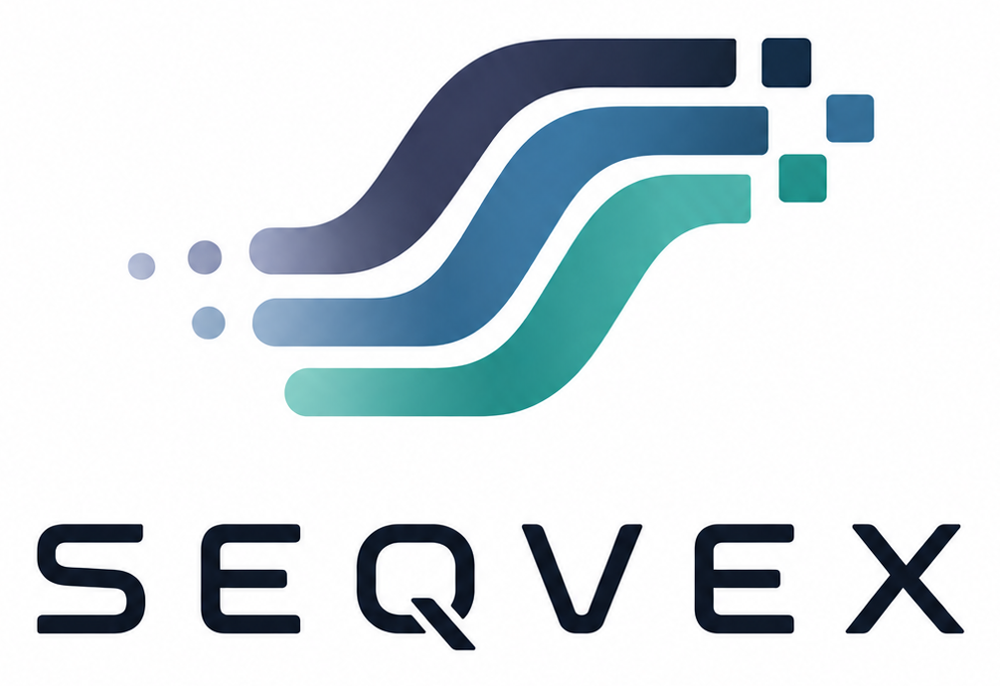
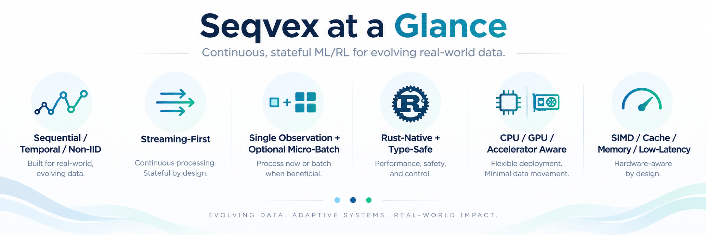
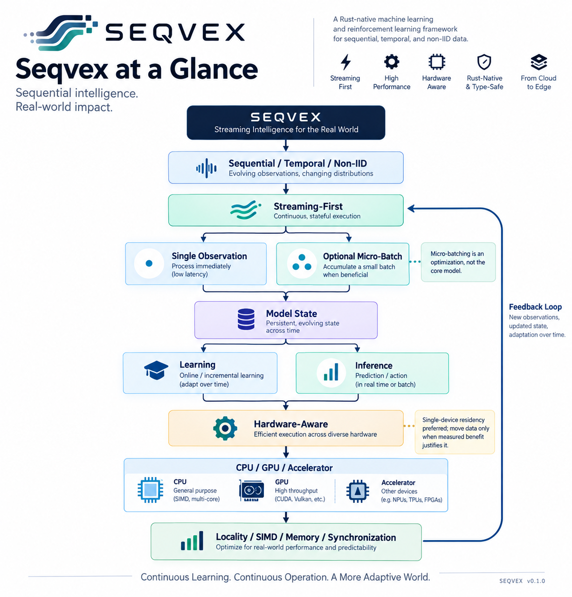
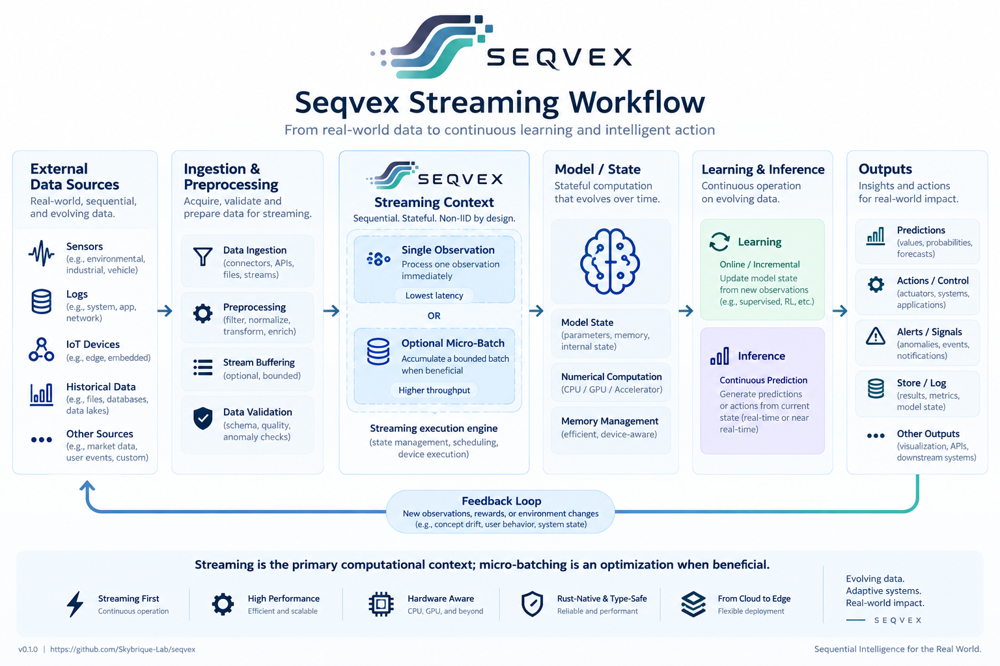
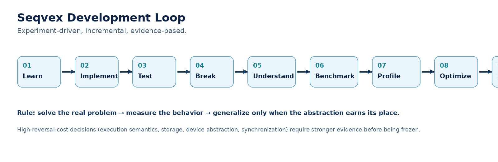

# Seqvex

<p align="center">
  
</p>

> **Streaming-first ML/RL for sequential, temporal, and non-IID data — with continuous state, online learning, and hardware-aware execution.**

Seqvex is an open-source, Rust-native machine learning and reinforcement learning framework designed from the ground up for **sequential, temporal, non-IID, and streaming workloads**.

The project starts from a practical problem: many real systems do not behave like a static IID dataset followed by a separate offline training stage. Observations arrive over time, distributions can evolve, models maintain state, and the system may need to learn and infer continuously.

Seqvex therefore treats **evolving data, stateful computation, and streaming execution as first-class concerns**.

<p align="center">
  
</p>

## Why Seqvex?

Conventional batch-oriented ML remains extremely useful. Large datasets and vectorized batches are often the right computational strategy.

Seqvex does not reject batching.

Instead, it changes the **semantic starting point**:

```text
sequential / temporal / non-IID
              ↓
        streaming-first
              ↓
     ┌────────┴────────┐
     │                 │
single observation   micro-batch
     │                 │
     └────────┬────────┘
              ↓
         model state
              ↓
     ┌────────┴────────┐
     │                 │
  learning          inference
     │                 │
     └────────┬────────┘
              ↓
       hardware-aware
              ↓
    CPU / GPU / accelerator
              ↓
 locality / SIMD / memory /
       synchronization
```

<p align="center">
  
</p>

**Streaming is the primary computational context.** Single-observation execution is fundamental. Bounded micro-batching and larger batch operations remain available when they provide computational or hardware efficiency without violating the semantics of the sequential workload.

## Core characteristics

- **Sequential / temporal / non-IID first** — evolving observations and changing distributions are central design concerns.
- **Streaming-first** — continuous, stateful computation is the primary execution context.
- **Single observation capable** — an observation can be processed immediately when latency matters.
- **Batch capable** — large batches remain available where algorithms and hardware benefit from them.
- **Optional micro-batching** — bounded aggregation can improve SIMD/GPU utilization without becoming the conceptual model.
- **Continuous state** — models can maintain and update state across observations.
- **Training and inference can be continuous** — online learning, inference, or both can operate within an evolving stream.
- **Hardware-aware** — CPU, GPU, and other accelerators are considered placement options.
- **Minimize data movement** — single-device residency is preferred when movement does not provide a measured benefit.
- **Rust-native and type-safe** — safe Rust is the default, with low-level control where justified.
- **Performance measured** — locality, cache behavior, allocation, SIMD, bandwidth, synchronization, and device movement are optimization surfaces.
- **Cloud-to-edge direction** — the architecture preserves a path toward constrained and potentially bare-metal environments.

## High-level workflow

<p align="center">
  
</p>

A typical system may look like:

```text
External data
     ↓
application ingestion / general data preparation
     ↓
Seqvex ML/RL preprocessing and representation
     ↓
Seqvex streaming context
     ↓
single observation
       OR
bounded micro-batch
     ↓
model / state
     ↓
learning and/or inference
     ↓
hardware-aware execution
     ↓
application outputs
     ↺
new observations / rewards / environment changes
```

General-purpose data ingestion, databases, ETL, domain logic, exploratory analysis, visualization, and storage remain outside the core framework. ML/RL preprocessing and representation remain within Seqvex when they form part of the computational pipeline.

## Training and inference

Seqvex does not require training and inference to be architecturally disconnected.

### Historical/offline training

Historical data can be replayed sequentially:

```text
x₁ → update
x₂ → update
x₃ → update
...
xₙ → update
```

or processed in batches where the algorithm benefits from aggregation.

### Online / continual learning

A live stream can continuously update model state:

```text
xₜ → predict → update → xₜ₊₁ → predict → update → ...
```

### Inference

Inference can likewise process observations individually or use bounded batching when throughput is more important than per-observation latency.

The key architectural property is that **the stream remains continuous even when the underlying computation is batched**.

## Scope

Seqvex differentiates its scope by **process responsibility rather than by individual function**. It owns the computational stages from ML/RL preprocessing and representation through model execution, training, validation, inference, and learning. General-purpose data ingestion, manipulation, cleaning, exploratory analysis, visualization, and storage remain outside the framework.

In practice, this means operations such as **one-hot encoding, normalization/standardization, PCA, rolling statistics, online statistics, and other transformations** may belong inside Seqvex when they form part of an ML/RL computational pipeline. The boundary is determined by the role the operation plays, not by the operation's name.

Seqvex focuses on:

- ML/RL preprocessing and representation required by the computational pipeline;
- machine learning algorithms;
- reinforcement learning;
- online and incremental learning;
- streaming estimators;
- sequential and temporal models;
- temporal/sequential validation;
- numerical computation required by ML/RL;
- execution/runtime mechanisms;
- hardware-aware computation.

Seqvex does not aim to become:

- a dataframe library;
- a general ETL framework;
- a database or storage system;
- a general-purpose data-cleaning platform;
- an exploratory data analysis environment;
- a visualization system;
- a domain/business-logic framework;
- a general data-ingestion platform.

Users can bring data from files, databases, sensors, message systems, Arrow/Polars workflows, or custom pipelines.

## Installation

Seqvex is published on crates.io.

```bash
cargo add seqvex
```

Or:

```toml
[dependencies]
seqvex = "0.1"
```

Then:

```bash
cargo build
```

> **Current status:** Seqvex `0.1.0` is an early foundational release. Public APIs and architecture are expected to evolve as implementation experience and measurements accumulate.

## Development

The project is intentionally developed incrementally:

<p align="center">
  
</p>

```text
Learn
  ↓
Implement the smallest useful experiment
  ↓
Test
  ↓
Break / find edge cases
  ↓
Understand
  ↓
Benchmark
  ↓
Profile
  ↓
Optimize
  ↓
Document
  ↓
Integrate
```

> **Do not create an abstraction until you have experienced the problem it solves.**

> **Do not optimize until you can measure the problem.**

## Documentation

- [`ARCHITECTURE.md`](ARCHITECTURE.md) — detailed technical architecture, execution model, layers, hardware direction, decisions, and deferred design questions.
- [`FAILURE_AND_RECOVERY.md`](docs/FAILURE_AND_RECOVERY.md)  — detailed potential recourse and address all critical failure events.
- [`CONTRIBUTING.md`](CONTRIBUTING.md) — contribution principles.
- [`DEVELOPMENT.md`](docs/DEVELOPMENT.md) — development principles.
- [`LICENSE`](LICENSE) — Apache License 2.0.

## Repository structure

Seqvex uses a Cargo workspace. Exact crate boundaries are deliberately not frozen.

Possible future components may include core types, numerical computation, online learning, sequential models, validation, execution/runtime, device backends, and algorithm families.

These are architectural directions, not a requirement to create every crate immediately.

## Contributing

Contributions, experiments, benchmarks, documentation, bug reports, and architectural discussion are welcome.

Before substantial changes, read the below documents:

1. [`ARCHITECTURE.md`](ARCHITECTURE.md)
2. [`DEVELOPMENT.md`](docs/DEVELOPMENT.md)
3. [`FAILURE_AND_RECOVERY.md`](docs/FAILURE_AND_RECOVERY.md)
4. [`CONTRIBUTING.md`](CONTRIBUTING.md)

Architecture changes should be supported by a concrete problem, evidence, and an understanding of reversal cost.

## License

Seqvex is licensed under the [Apache License 2.0](LICENSE).
